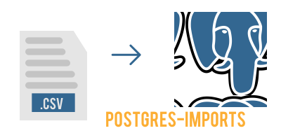

<p align="center">
   
</p>

# Postgres-exports

> Import in a simple way your .csv data to a postgres database

# :pushpin: Table of Contents


  * [Installation](#constructionworker-installation)
  * [Getting Started](#runner-getting-started)
  * [Faq](#postbox-faq)
  * [License](#closedbook-license)

## :construction_worker: Installation

**You need to install [Node.js](https://nodejs.org/en/download/) and [Yarn](https://yarnpkg.com/) first, then in order to clone the project via HTTPS, run this command:**

```git clone https://github.com/cunhaedu/postgres-exports.git```

**Install dependencies**

```yarn install```

## :runner: Getting Started

Before you run this program, you should have a .csv file.
First copy your .csv file and paste inside the [import](https://github.com/cunhaedu/postgres-imports/tree/master/import) folder, then rename your file to 'data.csv'

Run the following command in order to start the application:

```node index.js```


## :postbox: Faq

**Question:** What are the tecnologies used in this project?

**Answer:** The tecnologies used in this project are [NodeJS](https://nodejs.org/en/), [pg](https://www.npmjs.com/package/pg) to connect to Postgres, & [readline-sync](https://www.npmjs.com/package/readline-sync) to get informations about the Postgres connection .
##

## :closed_book: License

Released in 2020.
This project is under the [MIT license](https://github.com/cunhaedu/postgres-imports/tree/master/LICENSE).

Made by [Eduardo Assunção](https://github.com/cunhaedu)
